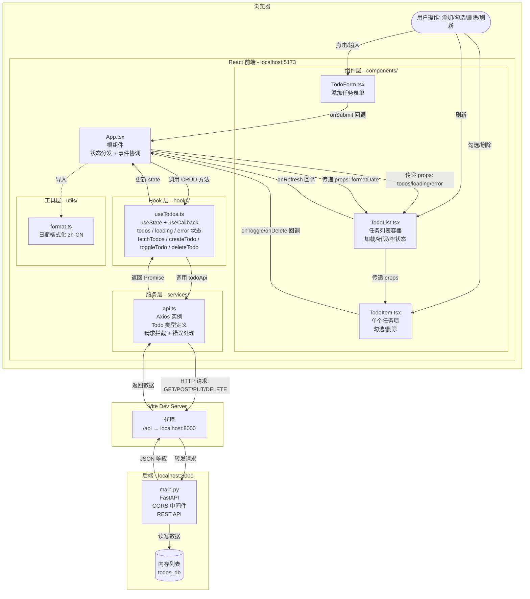

# Todo App — React + FastAPI

全栈 Todo 应用，前端 React 19 + TypeScript，后端 Python FastAPI。

## 技术栈

| 层 | 技术 |
|---|---|
| 前端框架 | React 19 |
| 语言 | TypeScript 5 (严格模式) |
| 构建工具 | Vite 7 |
| 样式 | Tailwind CSS 4 + 组件级 CSS |
| HTTP 客户端 | Axios |
| 代码检查 | ESLint 9 (flat config) + react-hooks + react-refresh |
| 后端框架 | Python FastAPI |
| 数据存储 | 内存列表 (无持久化) |

## 功能

- 添加待办事项（标题 + 可选描述）
- 勾选完成 / 取消完成
- 删除待办事项（带确认弹窗）
- 刷新任务列表
- 加载状态、错误状态、空列表提示

## 项目结构

```
demo0/
├── backend/
│   └── main.py                          # FastAPI 后端 (单文件，内存存储)
│
├── frontend/
│   ├── index.html                       # HTML 入口
│   ├── package.json                     # 依赖配置
│   ├── vite.config.ts                   # Vite 构建配置 + API 代理
│   ├── tsconfig.json                    # TypeScript 配置
│   ├── eslint.config.js                 # ESLint 配置
│   ├── .env                             # 环境变量 (VITE_API_URL)
│   │
│   └── src/
│       ├── main.tsx                     # 应用入口 (StrictMode)
│       ├── style.css                    # 全局样式
│       ├── App.tsx                      # 根组件 — 协调组件层与 Hook 层
│       ├── App.css                      # 根组件样式
│       │
│       ├── components/                  # UI 组件
│       │   ├── TodoForm.tsx             # 添加任务表单
│       │   ├── TodoList.tsx / .css      # 任务列表容器 (含加载/错误/空状态)
│       │   └── TodoItem.tsx / .css      # 单个任务项 (勾选/删除)
│       │
│       ├── hooks/                       # 自定义 Hook
│       │   └── useTodos.ts             # Todo CRUD 逻辑 + 状态管理
│       │
│       ├── services/                    # API 服务层
│       │   └── api.ts                  # Axios 实例 + Todo 类型定义
│       │
│       └── utils/                       # 工具函数
│           └── format.ts               # 日期格式化 (zh-CN)
│
└── README.md
```

## 架构说明



### 数据流说明

- **Props 向下**：`App.tsx` 将 `todos`、`loading`、`error`、回调函数通过 props 传给组件，组件不直接调用 API
- **事件向上**：组件触发事件 → 调用 App 的回调 → 调用 `useTodos` 的方法 → 调用 `api.ts` 发请求
- **状态集中**：所有业务状态（`todos`、`loading`、`error`）集中在 `useTodos` Hook 中管理
- **请求代理**：开发模式下 Vite 将 `/api` 前缀的请求代理到后端 `localhost:8000`，避免跨域

## 启动项目

### 前提条件

- Node.js (支持 ES2020)
- Python 3.8+
- pip 安装依赖：`pip install fastapi uvicorn`

### 1. 启动后端

```bash
cd backend
python main.py
# 运行在 http://localhost:8000
```

### 2. 启动前端

```bash
cd frontend
npm install
npm run dev
# 运行在 http://localhost:5173
```

> 需要先启动后端，否则前端会显示"获取待办失败，请确保后端服务已启动"的错误提示。

### 可用脚本

| 命令 | 作用 |
|---|---|
| `npm run dev` | 启动开发服务器 |
| `npm run build` | 构建生产版本 |
| `npm run preview` | 预览生产构建 (端口 4173) |
| `npm run type-check` | TypeScript 类型检查 |
| `npm run lint` | ESLint 代码检查 |

## 环境变量

前端环境变量在 `frontend/.env` 中配置：

| 变量 | 说明 | 默认值 |
|---|---|---|
| `VITE_API_URL` | 后端 API 地址 | `/api` (通过 Vite 代理转发) |

**两种 API 连接模式**：
- **代理模式** (开发推荐)：不设置 `VITE_API_URL` 或设为 `/api`，请求由 Vite 开发服务器代理到 `localhost:8000`，无跨域问题
- **直连模式**：设置 `VITE_API_URL=http://localhost:8000/api`，前端直接请求后端，依赖后端 CORS 配置

## API 接口

后端 API 路径统一以 `/api/todos` 开头，启动后可访问 `http://localhost:8000/docs` 查看 Swagger 文档。

| 方法 | 路径 | 说明 |
|---|---|---|
| GET | `/api/todos` | 获取所有待办事项 |
| GET | `/api/todos/{id}` | 获取单个待办事项 |
| POST | `/api/todos` | 创建待办事项 |
| PUT | `/api/todos/{id}` | 更新待办事项 |
| DELETE | `/api/todos/{id}` | 删除待办事项 |

**请求/响应示例**：

```json
// POST /api/todos
// 请求体
{ "title": "学习 React", "description": "完成 Hook 章节" }

// 响应 (201)
{ "id": 1, "title": "学习 React", "description": "完成 Hook 章节", "completed": false, "created_at": "2025-01-01T12:00:00" }
```

```json
// PUT /api/todos/1
// 请求体 (所有字段可选)
{ "completed": true }
```
